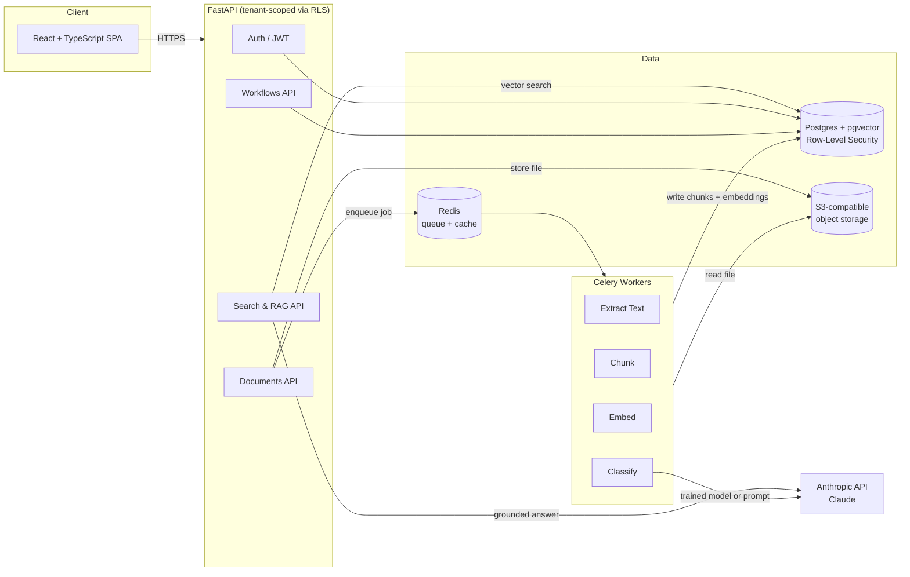

# Vector — Enterprise AI Workflow Platform

A secure, multi-tenant platform where business users upload documents, get them
automatically classified, search them semantically, ask grounded questions via
RAG, and route them through approval workflows — with a full audit trail.

Built to demonstrate applied AI engineering (RAG, embeddings, retrieval
evaluation) on top of production-grade platform architecture (multi-tenancy,
async processing, RBAC, immutable audit logging).

## Architecture



## Why these choices

**Postgres + pgvector instead of a dedicated vector DB.** One datastore to
run, back up, and secure. RLS-based tenant isolation covers vector data the
same way it covers everything else — a separate vector store would need its
own isolation story. See `docs/DESIGN_DECISIONS.md` for when this stops being
the right call.

**Celery instead of Kafka.** This system doesn't have multiple independent
consumers or a replay requirement — it has one job type (process a document)
that needs to run off the request path. Celery + Redis gets there with a
fraction of the operational surface.

**Row-Level Security for multi-tenancy, not schema-per-tenant.** Every
tenant-scoped table is protected by a Postgres RLS policy
(`alembic/versions/0002_enable_row_level_security.py`) keyed on a session
variable set at the top of every request
(`app/db/session.py::set_tenant_context`). A bug in application code that
forgets a `WHERE tenant_id = ...` clause still cannot leak another tenant's
rows — the database enforces it, not just the application.

**Append-only audit log, enforced by a DB trigger.** `audit_log` rows cannot
be updated or deleted, even by the table owner — see the trigger in the same
migration. An audit trail that can be quietly edited isn't one a company would
trust.

**Local embeddings (BAAI/bge-small) by default, not an API model.** No
per-document API cost, no tenant data leaving the server to embed it, and a
built-in comparison point against an API embedding model — see
`docs/EVALS.md`.

## Repo layout

```
backend/
  app/
    api/routes/       FastAPI routers (documents, search & RAG)
    core/              config, Celery app
    db/                SQLAlchemy engine/session + tenant context
    models/            SQLAlchemy models (tenant-scoped via mixin)
    schemas/           Pydantic request/response models
    services/          text extraction, embeddings, classification, RAG, audit
  alembic/versions/     0001 extensions, 0002 row-level security
docs/
  DESIGN_DECISIONS.md   tradeoffs + "what I'd change at 10x scale"
  EVALS.md              retrieval evaluation methodology and results
docker-compose.yml
```

## Running locally

```bash
cp backend/.env.example backend/.env
# fill in ANTHROPIC_API_KEY at minimum

docker compose up --build

# in a second terminal, once postgres is healthy:
docker compose exec api alembic revision --autogenerate -m "initial schema"
docker compose exec api alembic upgrade head
```

API docs available at `http://localhost:8000/docs` once running.

## Status / roadmap

- [x] Multi-tenant schema with enforced RLS
- [x] Async document pipeline: extract → chunk → embed → classify
- [x] Semantic search + grounded RAG Q&A with citations and a confidence floor
- [x] Append-only audit log
- [ ] Fine-tuned document classifier (vs. current LLM-prompt fallback) — see `docs/EVALS.md`
- [ ] Hybrid (keyword + vector) retrieval and reranking
- [ ] Workflow approval routing UI
- [ ] SSO (SAML/OIDC) via WorkOS — stubbed as JWT auth for now
- [ ] React frontend
